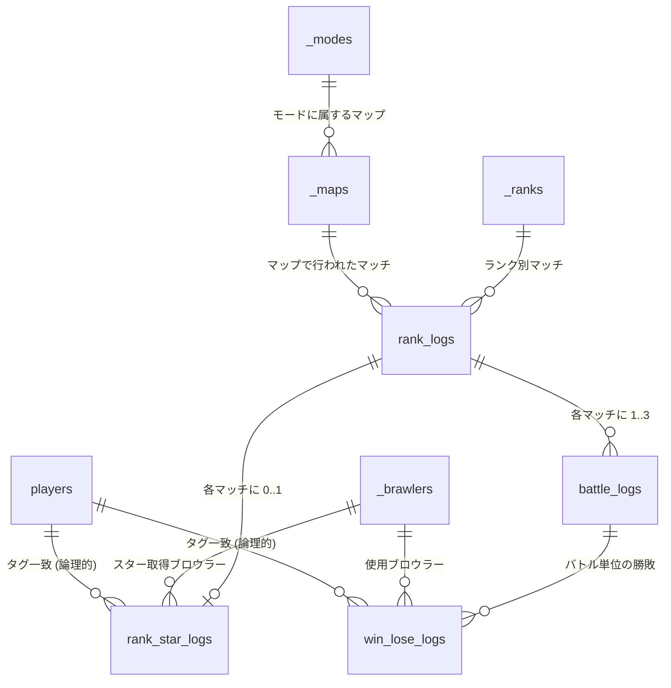

# データベーススキーマとゲーム仕様の関係整理

本ドキュメントでは、Brawl Stars のランク戦（Power League）を対象にした本アプリケーションのデータベーススキーマについて、ゲーム仕様と照らし合わせながらテーブル間の関係性を整理します。データパイプラインの設計意図や各スキーマが担う役割を把握することで、集計処理や機能追加時の影響範囲を明確にできます。

## ランク戦（Power League）のゲーム仕様

- **対戦形式**: 3 対 3 のチームバトルをラウンド単位で進行し、マッチ全体を `rank_logs` 1 行として記録します。ダイヤモンドランク以下は 1 ラウンド先取、エリートランク以上は 2 ラウンド先取で勝敗が決し、ラウンドごとの詳細は `battle_logs` に保存されます。
- **マップとモード**: シーズンごとに定義されたモードとマップの組み合わせでマッチングが行われます。モードは Gem Grab などのルール種別、マップは具体的な戦場のレイアウトを指します。
- **ランク帯**: ブロンズからマスターまでの段階的なランクが存在し、マッチは同一ランク帯同士で行われます。本アプリでは `_ranks` にマスター情報を格納します。
- **使用キャラクター（ブロウラー）**: 各プレイヤーは試合ごとに 1 体のブロウラーを選択し、勝利したチーム・敗北したチームの構成が分析対象になります。
- **スタープレイヤー**: マッチ終了後に MVP として 1 名のスタープレイヤーが選出されます。MVP のブロウラー情報は `rank_star_logs` で管理し、スター取得率などの指標に活用します。
- **監視対象プレイヤー**: 競技シーンなどで追跡したいプレイヤーをリスト化でき、優先的にログ収集が行われます。監視対象は `players` テーブルでフラグ管理します。

## テーブル別の役割と主なカラム

| テーブル | 役割 | 主なカラム | 関係性のポイント |
| --- | --- | --- | --- |
| `players` | プレイヤーの基本情報と監視設定を保持 | `tag`, `name`, `highest_rank`, `is_monitored`, `monitoring_started_at` | バトルログ内のプレイヤータグと突合。`win_lose_logs`・`rank_star_logs` から参照されるタグと対応するが、外部キー制約は設けず疎結合にして API 由来の未知タグを許容。 |
| `_modes` | ランク戦モードのマスターデータ | `id`, `name`, `name_ja` | `_maps.mode_id` から参照される親テーブル。 |
| `_maps` | 各モードに紐づくマップのマスターデータ | `id`, `name`, `mode_id` | `rank_logs.map_id` の参照先。マップ別統計の軸となる。 |
| `_ranks` | ランク帯のマスターデータ | `id`, `name`, `name_ja` | `rank_logs.rank_id` の参照先。ランク別集計の軸。 |
| `_brawlers` | ブロウラー（キャラクター）のマスターデータ | `id`, `name_ja` | `win_lose_logs`, `rank_star_logs` などブロウラー ID を必要とするテーブルから参照。 |
| `rank_logs` | 1 マッチ単位のランク戦ログ | `id`, `map_id`, `rank_id` | `_maps`・`_ranks` とリレーション。`battle_logs`・`rank_star_logs` の親。 |
| `rank_star_logs` | マッチのスタープレイヤー情報 | `rank_log_id`, `star_brawler_id`, `star_player_tag` | `rank_logs` と 1 対 1。スタープレイヤーのブロウラー・タグを記録。 |
| `battle_logs` | API で取得した個別バトルログ（マッチ内部の戦闘） | `id`, `rank_log_id` | 各ラウンドやリマッチを同一 `rank_log_id` に束ね、1 マッチ（`rank_logs`）につき 1～3 行が格納される。`win_lose_logs` の親。 |
| `win_lose_logs` | 勝敗と使用ブロウラーの組み合わせ | `win_brawler_id`, `lose_brawler_id`, `battle_log_id`, `win_player_tag`, `lose_player_tag` | 1 バトルの勝者・敗者のブロウラー組み合わせを格納。`battle_logs` と多対 1。勝利チーム 3 名 × 敗北チーム 3 名 = 9 行が基本。 |

## リレーション概要（Mermaid ER 図）

> ※ `players` との関連は外部キーではなく論理的な突合を表すため、ER 図上では点線の意味合いとしてコメントで補足しています。

## データフローと利用シーン

1. **ログ取得 (`src/fetch_battlelog.py`)**
   - Brawl Stars API からランク戦バトルログを取得。
   - マッチ情報は `rank_logs` に挿入され、関連するモード・マップ・ランクが存在しない場合は事前に `sql/insert_master.sql` を適用しておく必要があります。
   - 各ラウンドの詳細は `battle_logs`、勝者・敗者の組み合わせは `win_lose_logs`、スター情報は `rank_star_logs` へ保存。
   - 収集したプレイヤータグは `players` テーブルを更新し、監視対象プレイヤーの `last_fetched` を最新化。

2. **統計出力 (`src/export_all_stats.py` ほか)**
   - `win_lose_logs` を基にブロウラー対面勝率、味方シナジー、3 対 3 構成別勝率を算出。
   - `rank_star_logs` からスター取得率、`battle_logs` からマッチ数を集計。
   - `players` の `is_monitored` フラグでフィルタリングし、監視対象プレイヤー向けレポートを生成。

3. **監視プレイヤー管理 (`scripts/player_monitoring.py`)**
   - 監視対象の追加・解除・一覧を `players` テーブルで制御。
   - 監視状態は収集パイプラインが参照し、優先的に API リクエストを行う。

## 分析の観点から見たテーブルの紐付き

- **マップ・ランク × 勝率分析**: `rank_logs` のキーでマップとランクを特定し、紐づく `battle_logs` と `win_lose_logs` を集計することで、特定条件下の勝率やピック率を算出できます。
- **スター取得率分析**: `rank_star_logs` の `star_brawler_id` と `rank_log_id` を手がかりに、ランク・マップ別にスター獲得頻度を求めます。
- **プレイヤーパフォーマンス追跡**: `win_lose_logs` に格納された `win_player_tag` / `lose_player_tag` を `players` の監視リストと突合し、対象プレイヤーの勝敗・使用ブロウラーの傾向を抽出します。
- **メタ変動の検知**: `_maps` と `_ranks` を軸に `win_lose_logs` を時系列で集計し、特定ブロウラーの勝率変化や相性変化をモニタリングできます。

## 拡張時の留意事項

- **マスターデータの更新**: 新モード・新マップ・新ブロウラーが追加された場合は、`_modes`・`_maps`・`_brawlers` への登録を `sql/insert_master.sql` に追記し、既存データとの整合性を保つ必要があります。
- **外部キー制約の追加検討**: プレイヤータグに対する外部キーを追加する場合は、API から取得した未登録タグをどのように扱うか（遅延登録か、一時テーブルを用いるか）を検討してください。
- **パーティサイズの変化対応**: ランク戦以外のモード（デュオ、ソロなど）を扱う場合は、`win_lose_logs` のデータモデリングや主キー設計を見直す必要があります。
- **履歴管理**: `players.last_fetched` の更新頻度が高いため、履歴分析を行いたい場合は別途監査テーブルを設けるなどの対応を検討してください。

以上の情報を踏まえ、データ集計や新機能追加の際には各テーブルの役割と関連性を考慮した設計・実装を行ってください。
